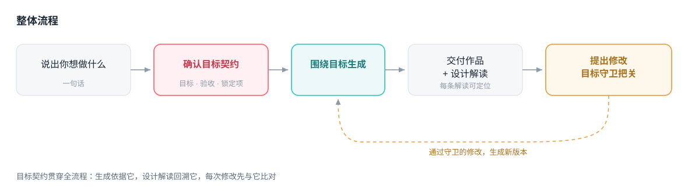

# GoalKeeper

**目标先于产出的 AI 创作平台。**

一句话就能生成可玩的 H5，这件事很多平台都能做。GoalKeeper 的不同在于：它先把需求背后的**目标**问清楚、锁成契约，再据此设计作品；交付时告诉你每处设计如何服务这个目标；之后每一次修改，都会先判断它是否偏离了当初确认的目标。

👉 **在线体验**：https://vincwu-feng.github.io/Goalkeeper/

---

## 解决什么问题

用 AI 生成东西，第一版通常不对，然后反复改提示词，生成十几版仍不满意。根因不是模型不行，是**目标在生成之前就没有对齐**。

「我想做一个性格测试」背后可能是抖音涨粉、变现赚钱、品牌营销或纯娱乐。四种目标对应的结构、交互、商业化设计完全不同：

| 同样是性格测试 | 目标决定了怎么做 |
| --- | --- |
| 涨粉 | 流程尽量短，结果页强分享属性，分享后解锁详细报告 |
| 变现 | 情绪高点埋付费触发，免费可完整游玩，付费是增值项 |
| 品牌营销 | 品牌视觉定制，结果页引导关注与留资 |
| 自己玩 | 轻松娱乐向，无商业化设计，结果可与好友对比 |

AI 第一轮就猜目标，猜错之后用户所有修改都在把错的往对的掰。GoalKeeper 把这一步提到生成之前。

---

## 产品逻辑

整个产品由一条主线串起来：**目标契约**。

用户的目标不是一个标签，而是一份结构化的契约——包含创作目的、验收标准、不可改动的锁定项。它在生成前确立，之后成为全流程的唯一依据：

- **生成阶段**：作品的核心机制围绕契约设计，而不是套用通用模板
- **交付阶段**：设计说明逐条回溯契约，解释每处设计服务哪个目标
- **修改阶段**：新需求先与契约比对，判断是纯优化还是动了目标本身

因为目标是结构化的，机器才有判定依据。这也是用契约而不是提示词的原因——提示词没有结构，无法判断「这次修改违不违背目标」。

---

## 用户使用路径

### Step 1 · 提出需求

打开即是对话界面，直接写想做什么：

> 帮我做一个男朋友求生欲测试小游戏

### Step 2 · 确认目标

系统不会立刻开始，而是先问用途，给出可点选的目标方向（涨粉 / 变现 / 品牌营销 / 自己玩）。选定后再追问 1-2 个关键问题锁定细节，形成目标契约。

全程对话流完成，不需要填表单、不需要跳页。

### Step 3 · 创作过程

契约确认后进入生成。这个阶段展示的不是进度条和代码流，而是**设计语言**——用户看到的是 AI 在为自己的目标做判断：

- 设计情绪高点付费触发点
- 配置激励广告复活机制
- 优化结果页付费解锁布局

等待的这段时间同时给出场景化推荐：达成这个目标，除了作品本身你还需要什么工具（涨粉需要剪辑与标签工具，变现需要广告联盟与支付通道，营销需要数据埋点与渠道码）。

创作过程中输入框始终可用，可以补充需求或取消。

### Step 4 · 交付作品与设计说明

作品可在手机框内直接试玩，右侧同时给出**目标设计说明**：

> ① 第 2 关失败时插入激励广告复活 → 用户刚投入游戏，弃坑成本最高，此时复活接受度远高于开局弹广告
>
> ② 结果页深度报告付费解锁 → 利用对未完成事物的执念，低门槛冲动消费转化率更高

每条说明都指向作品内的具体位置，点击可定位过去，用户能在预览里逐条验证。

解决的是信任问题：AI 生成结果是黑盒，用户不知道为什么长这样，也就无法判断好不好、该怎么提改。

### Step 5 · 迭代与目标守卫

提出修改时，系统先判断影响：

- **纯优化**（改字号、调间距、换配色）→ 直接生成新版本
- **动了契约**（去掉付费解锁、改变核心玩法）→ 先说明会影响哪个目标、影响多大，给出替代方案，由用户决定

用户坚持要改，也能改；设计说明里会把对应条目标记为「已移除（用户决策）」，保持透明。每个版本都可回滚，用户手上永远有一个可用版本。

---

## 功能特点

| 特点 | 说明 |
| --- | --- |
| 目标契约 | 生成前追问到目标清楚，写成结构化契约，全程以它为依据 |
| 目标驱动设计 | 同一需求在不同目标下长出不同的机制与结构 |
| 创作过程透明 | 用设计语言而非技术进度展示，用户理解 AI 在做什么决策 |
| 目标设计说明 | 逐条解释设计意图，可定位到作品内位置，支持逐条验证 |
| 目标守卫 | 区分纯优化与目标变更，偏离时提示影响并给替代方案 |
| 交付前检查 | 作品需通过多档移动端宽度下的布局与可用性检查才交付 |
| 版本历史与回滚 | 每版可追溯、可回退，修改失败不会破坏当前可用版本 |
| 场景化推荐 | 等待期按目标推荐上下游工具，补齐达成目标的完整链路 |

---

## 一句话总结

> 其他 AI 创作平台是「你说做什么，我给你做一个」——做完给你一个文件，好不好用、能不能达成目的你自己判断。
>
> GoalKeeper 是「你告诉我为什么做，我为这个目的设计一个作品，并且告诉你我在哪做了什么设计、为什么有效」——它不是一个执行工具，是一个懂目标、有设计判断、会保护你目标完整性的创作搭档。

---

## 关于本仓库

本仓库为可交互体验部分，服务端与其他配置持续更新中。

## 作者

AI 产品经理。产品定义、机制设计、交互决策与全部实现推进由我完成。
